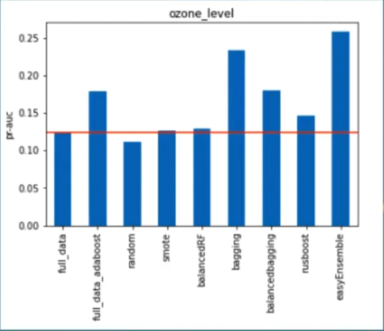
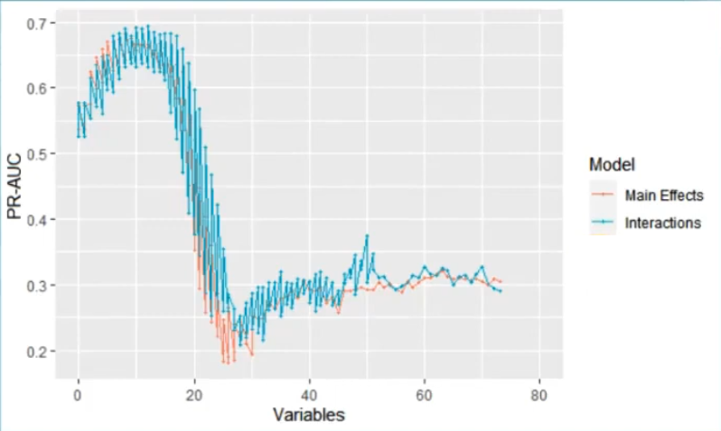

# Projeto18
Conjunto de dados extremamente desbalanceado

Este projeto apresenta o conjunto de dados de [detecçao de niveis de ozonio](https://archive.ics.uci.edu/dataset/172/ozone+level+detection)  

O conjunto tem 2536 observaçoes,72 variáveis e desbalanceamento de 3%. O objetivo é prever o nível de ozonio,como alto ou baixo.
A primeira tentativa foi a de usar algoritmos para dados desbalanceados,como Rusboost,EasyEnsemble,BalancedRF e BalancedBagging.

Fig1. Algoritmos utilizados e o PR-AUC obtido

  

Com o intuito de melhorar os resultados ruins foi utilizado eliminaçao recursiva de variaveis(RFE)

Fig2. Número de variáveis usadas e o PR-AUC obtido

 
